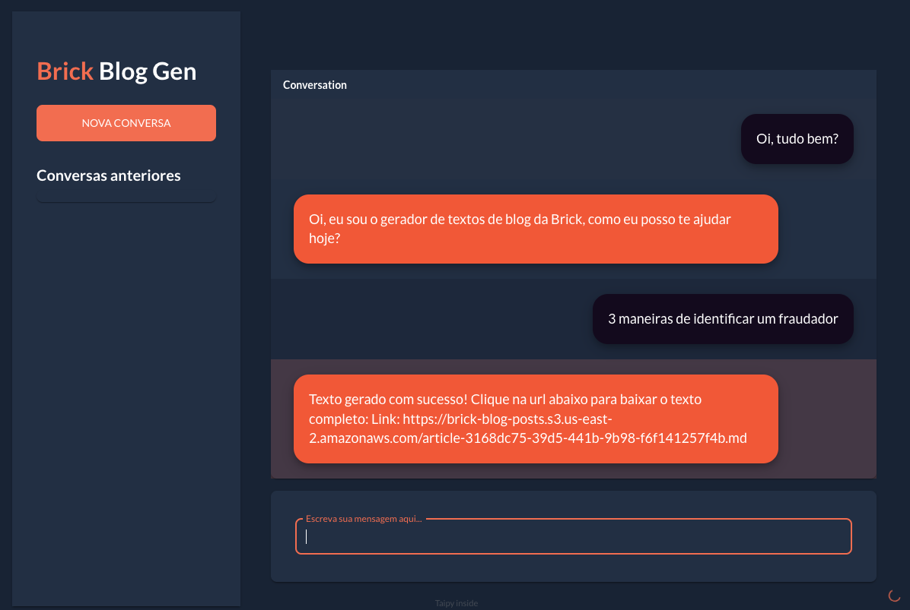
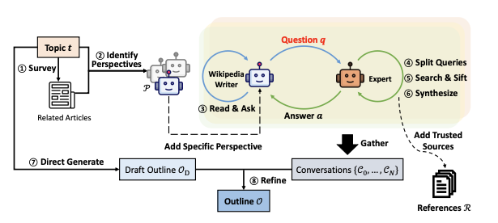

# Blog Post Generator


### Overview
This is a simple tool that generates blog posts from given questions. 

It was built based on a paper called <a href="https://arxiv.org/pdf/2402.14207">STORM<a> - Synthesis of Topic Outlines through
Retrieval and Multi-perspective Question Asking.

The intuition to generate a blog post from a given topic is:
- We build a outline of the expected result
- We generate 5 others related topics
- We create 3 different experts (LLM Prompts) based on those topics and an external knowledge base. (In this case *Blog das Locadoras* and *Google Search*) 
- We conduct an interview process with each one of those experts. 
- We use those discussions to refine our outline and write each of those sections.
- With the refined outline and the draft of the sections we use Long Context LLMs to write the full article. 



### Installation

```
    pip install -r requirements.txt
```

### Environment

Required ENVS:
```
OPENAI_API_KEY=

API_KEY=

FLASK_ENV=

S3_BUCKET=
S3_ACCESS_KEY=
S3_SECRET_KEY=
S3_REGION=
```

Optional ENVS (For metrics and monitoring):
```
LANGCHAIN_TRACING_V2=
LANGCHAIN_ENDPOINT=
LANGCHAIN_API_KEY=
LANGCHAIN_PROJECT=
```

### Execution

```
    python app.py
```

### Web Interface
It was used taipy to create a quick web interface.

```
    cd taipy

    python main.py
```

### Next Steps
Iterate on how to build the best experts.

How to bring the right context about Brick's business.

How to optimize for SEO.

### References

- STORM Paper: https://arxiv.org/pdf/2402.14207

- Langchain implementation: https://github.com/langchain-ai/langgraph/blob/main/examples/storm/storm.ipynb